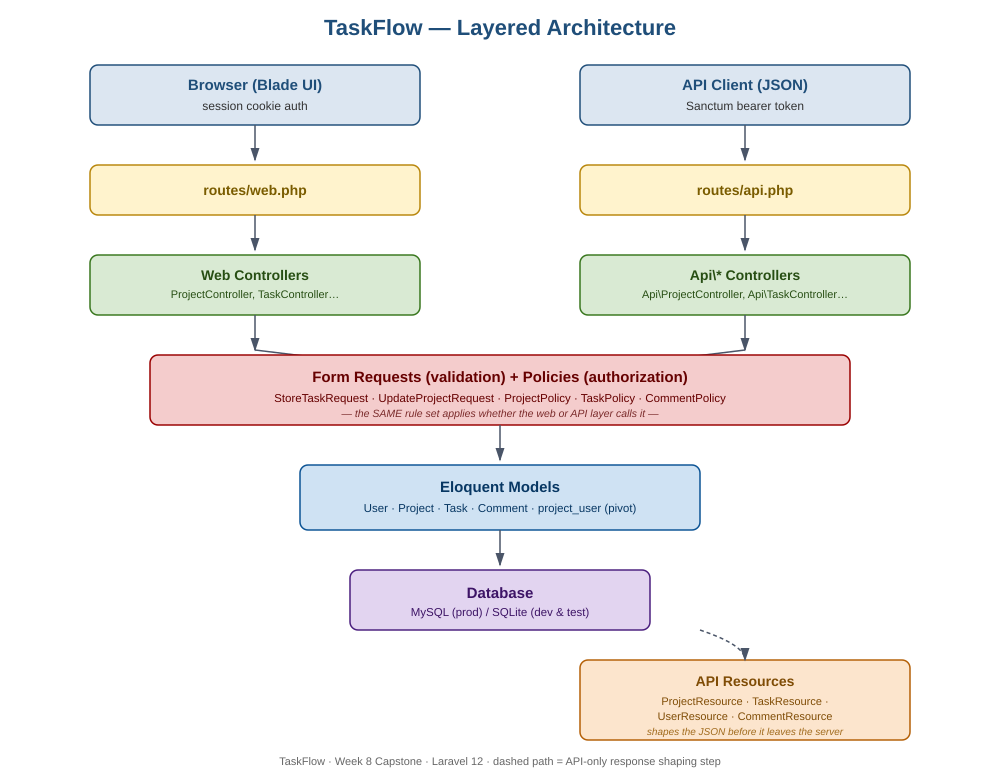

# TaskFlow

**A production-style Laravel project & task management platform** — built end-to-end across an 8-week backend internship as a capstone demonstrating database design, authentication, authorization, REST API design, automated testing, and deployment readiness.

[](https://laravel.com)
[](https://php.net)
[](#testing)
[](LICENSE)

> **Capstone status:** Fully implemented, running, and tested locally against a real Laravel 12 installation — not just a code sample. See [`docs/CODE_FLOW.md`](docs/CODE_FLOW.md) for a request-by-request walkthrough and [`docs/PRESENTATION.md`](docs/PRESENTATION.md) for the project defense script.

---

## Table of Contents

- [Overview](#overview)
- [Why This Project](#why-this-project)
- [Features](#features)
- [Tech Stack](#tech-stack)
- [Architecture](#architecture)
- [Database Schema](#database-schema)
- [API Reference](#api-reference)
- [Getting Started](#getting-started)
- [Testing](#testing)
- [Project Structure](#project-structure)
- [Development Timeline](#development-timeline)
- [Known Limitations & Roadmap](#known-limitations--roadmap)
- [Author](#author)

---

## Overview

TaskFlow is a multi-user **project and task management system** — think a lightweight Trello/Jira — where teams create projects, invite members with roles, break work into tasks tracked through a Kanban workflow (`To Do → In Progress → In Review → Done`), and discuss progress through task-level comments.

It ships with **two complete, parallel interfaces to the same data**:

1. A server-rendered **Blade + Tailwind web app** (session-based auth) for day-to-day use in a browser.
2. A **token-authenticated REST API** (Laravel Sanctum) for any external client — a mobile app, a JS frontend, or an integration.

Both interfaces share the exact same Eloquent models, the exact same Policy-based authorization rules, and the exact same database — so access control can never silently drift between "what the website allows" and "what the API allows."

## Why This Project

This capstone was designed to exercise every skill a backend/full-stack Laravel developer is expected to demonstrate in production work, inside one coherent product rather than four disconnected exercises:

| Skill | Where it shows up |
|---|---|
| Relational database design & normalization | 5-table schema with 1:N, M:N, and nullable FK relationships — [Day 36](../Day36) |
| Eloquent ORM, query scopes, model-level access rules | `Project::hasAccess()`, `visibleTo()` scope — [Day 37](../Day37) |
| Server-rendered UI with Blade | Kanban board, auth forms, dashboard — [Day 37](../Day37) |
| Authentication (session + token) | Laravel's built-in auth guard + Sanctum — [Day 38](../Day38) |
| Authorization via Policies | `ProjectPolicy`, `TaskPolicy`, `CommentPolicy` — [Day 38](../Day38) |
| RESTful API design | 21 versioned, resource-shaped JSON endpoints — [Day 38](../Day38) |
| Automated testing | 16 PHPUnit feature tests, 47 assertions, all passing — [Day 39](../Day39) |
| Debugging real framework behavior | 3 genuine Laravel 12 bugs found & fixed while wiring the app together — [Day 39](../Day39) |
| Deployment readiness | `.env.example`, CI pipeline, deployment guide — [Day 39](../Day39) |
| Git/GitHub workflow & technical presentation | This folder — [Day 40](.) |

## Features

- 🔐 **Authentication** — registration, login, logout, bcrypt password hashing, Sanctum API tokens
- 📁 **Project management** — create, edit, archive, delete; status lifecycle (`planning → active → completed → archived`)
- 👥 **Team membership** — add/remove members per project with a project-scoped role (`manager` / `member`), independent of any global role
- ✅ **Task management** — full CRUD, status + priority tracking, due dates, assignment, overdue detection
- 🗂️ **Kanban board UI** — tasks grouped live by status, driven directly off the `Task::STATUSES` constant
- 💬 **Comments** — threaded discussion per task
- 🛡️ **Policy-based authorization** — every read/write action checked against `ProjectPolicy` / `TaskPolicy` / `CommentPolicy`, shared identically between the web and API layers
- 🌐 **Full REST API** — Sanctum-protected, resource-shaped JSON, mirrors 100% of web functionality
- 🧪 **Automated test suite** — feature tests covering auth, access control, cascading deletes, and business logic (overdue flagging)
- 🚀 **Deployment-ready** — environment template, GitHub Actions CI, and a written deployment/rollback runbook

## Tech Stack

| Layer | Technology |
|---|---|
| Language / Framework | PHP 8.3, Laravel 12 |
| Database | MySQL 8 in production, SQLite for local dev/testing |
| Auth | Laravel session guard (web) + Laravel Sanctum (API) |
| Templating | Blade |
| Styling | Tailwind CSS |
| Testing | PHPUnit / Laravel's testing helpers |
| CI | GitHub Actions |
| Version control | Git / GitHub |

## Architecture

TaskFlow follows a conventional layered Laravel architecture — routes never touch the database directly, and business rules live in exactly one place regardless of which interface (web or API) triggers them.



```
                     ┌─────────────────────┐        ┌─────────────────────┐
                     │   Browser (Blade)   │        │  API Client (JSON)  │
                     │  session cookie     │        │  Sanctum bearer     │
                     └──────────┬──────────┘        └──────────┬──────────┘
                                │                                │
                        routes/web.php                   routes/api.php
                                │                                │
                    ┌───────────▼───────────┐        ┌───────────▼───────────┐
                    │  Web Controllers        │        │  Api\* Controllers     │
                    │  (ProjectController...) │        │  (Api\ProjectController)│
                    └───────────┬───────────┘        └───────────┬───────────┘
                                │                                │
                    ┌───────────▼────────────────────────────────▼───────────┐
                    │      Form Requests (validation)  +  Policies (authz)    │
                    │  StoreTaskRequest, UpdateProjectRequest, ProjectPolicy… │
                    └───────────────────────────┬──────────────────────────── ┘
                                                 │
                                    ┌────────────▼────────────┐
                                    │   Eloquent Models         │
                                    │   User · Project · Task   │
                                    │   Comment · project_user   │
                                    └────────────┬────────────┘
                                                 │
                                    ┌────────────▼────────────┐
                                    │        Database            │
                                    │  (MySQL / SQLite)           │
                                    └─────────────────────────┘

                    API responses only, before leaving the server:
                    Eloquent Model ──► API Resource (ProjectResource, TaskResource…) ──► JSON
```

See [`docs/CODE_FLOW.md`](docs/CODE_FLOW.md) for two fully traced requests (one web, one API) walking through every one of these layers with real code.

## Database Schema

Five tables, normalized to 3NF, with deliberate cascade/null-on-delete rules per relationship (see [`Day36/docs/02-database-schema.md`](../Day36/docs/02-database-schema.md) for the full design rationale):

```
users ──< projects (owner_id)
users ──< project_user >── projects      (many-to-many team membership, with a per-project role)
projects ──< tasks
users ──< tasks (assigned_to, nullable)
tasks ──< comments >── users
```

## API Reference

Full route map with auth requirements: [`Day36/docs/03-api-routes.md`](../Day36/docs/03-api-routes.md). Quick summary — 21 Sanctum-protected endpoints covering auth, projects, membership, tasks, and comments, all documented and importable via the included [Postman collection](postman/TaskFlow.postman_collection.json).

```
POST   /api/register              POST   /api/login              POST /api/logout        GET /api/user
GET    /api/projects              POST   /api/projects           GET  /api/projects/{id} PUT/DELETE /api/projects/{id}
POST   /api/projects/{id}/members DELETE /api/projects/{id}/members/{user}
GET    /api/projects/{id}/tasks   POST   /api/projects/{id}/tasks GET  /api/tasks/{id}    PUT/DELETE /api/tasks/{id}
GET    /api/tasks/{id}/comments   POST   /api/tasks/{id}/comments DELETE /api/comments/{id}
GET    /api/dashboard/stats
```

## Getting Started

```bash
# 1. Install dependencies
composer install
npm install --legacy-peer-deps

# 2. Environment setup
cp .env.example .env
php artisan key:generate

# 3. Database
touch database/database.sqlite   # or configure MySQL in .env
php artisan migrate

# 4. Build frontend assets
npm run build

# 5. Serve
php artisan serve
```

Visit `http://127.0.0.1:8000/register` to create an account and land on the dashboard.

## Testing

```bash
php artisan test
```

```
Tests:    16 passed (47 assertions)
Duration: 0.74s
```

Coverage includes: registration/login/logout, duplicate-email rejection, credential-leak prevention, project ownership & membership access control, cascading deletes, task CRUD + status validation, member-vs-owner permission boundaries, and overdue-task detection logic. See [`Day39/docs/BUGFIXES.md`](../Day39/docs/BUGFIXES.md) for the bugs this suite actually caught — three of them only surfaced once the code was run against a real Laravel 12 install, not while reading the source.

## Project Structure

```
taskflow/
├── app/
│   ├── Http/
│   │   ├── Controllers/       # Web controllers (session-based)
│   │   │   ├── Auth/          # Registration & login
│   │   │   └── Api/           # JSON API controllers (Sanctum)
│   │   ├── Requests/          # Form Request validation + authorization
│   │   └── Resources/         # API response shaping
│   ├── Models/                # User, Project, Task, Comment
│   └── Policies/              # ProjectPolicy, TaskPolicy, CommentPolicy
├── database/
│   └── migrations/            # 5 custom migrations + Sanctum's token table
├── resources/views/           # Blade templates (layout, auth, projects, tasks, dashboard)
├── routes/
│   ├── web.php                 # Session-authenticated browser routes
│   └── api.php                 # Sanctum-authenticated JSON routes
└── tests/Feature/              # PHPUnit feature test suite
```

## Development Timeline

| Day | Milestone |
|---|---|
| 36 | Planning — features, ERD, normalized schema, API route map |
| 37 | Core build — models, web controllers, Blade UI, Kanban board |
| 38 | Auth, Policies, Form Requests, API Resources, full REST API |
| 39 | Automated testing, real bug fixes, deployment prep |
| **40** | **This folder** — presentation, code-flow documentation, GitHub submission |

## Known Limitations & Roadmap

Documented honestly rather than hidden — see [`docs/PRESENTATION.md`](docs/PRESENTATION.md) for how these are framed in the project defense:

- No real-time updates (would use Laravel Echo/WebSockets for live Kanban board sync across users)
- No file attachments on tasks
- No time tracking or billing
- Single-server deployment story only (no queue-worker scaling covered)

These were explicitly scoped **out** on Day 36 to keep the capstone finishable and demo-able within the internship timeline, rather than left unbuilt by accident.

## Author

**Hamdan Ali**
BS Software Engineering — Air University, Islamabad
Software Engineering Internship — Week 8 Capstone Project
